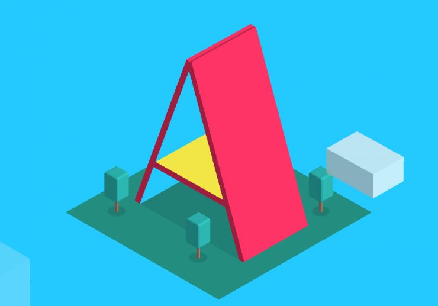
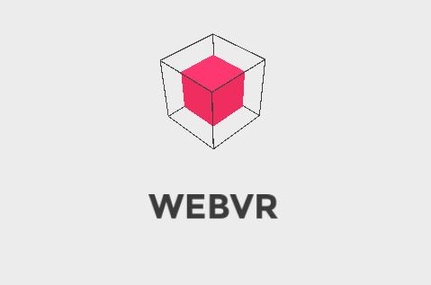
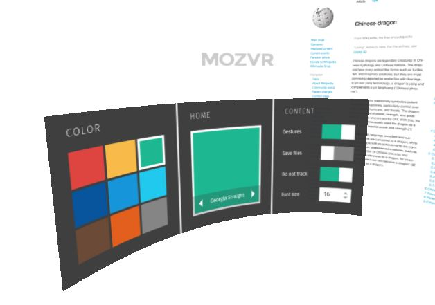
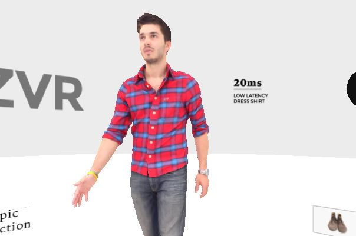
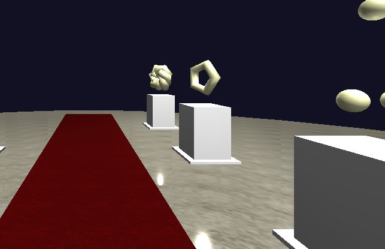
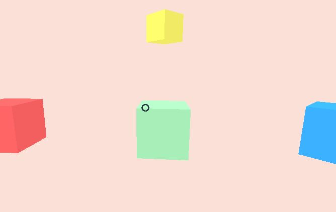
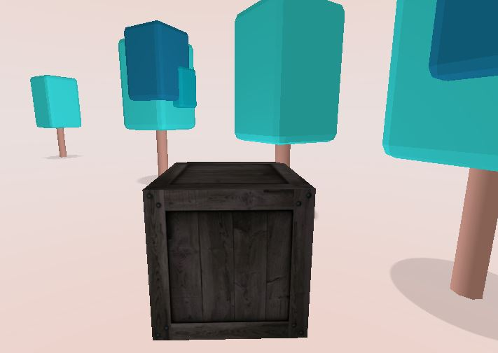
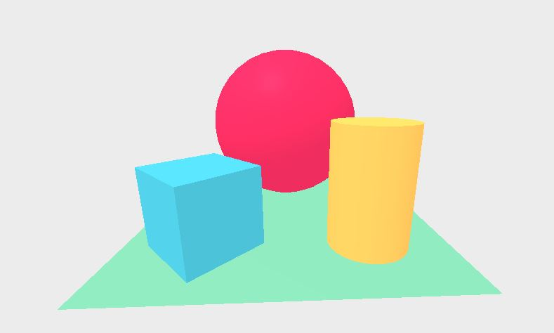

# A-Frame介绍
## 目录
[TOC]
## 1 什么是A-Frame？

[A-Frame][aframe]是由[Mozilla][mozilla]旗下的VR团队[MozVR][mozvr]设计和维护的一个开源框架，使开发者不必学习3D绘图标准WebGL复杂的API，就能够轻松完成3D或VR网页的制作。
A-Frame的使用简单到什么程度呢？只要在网页文件中加入以下一行代码，就可以将A-Frame组件集成到网页中，通过使用熟悉的HTML代码方式，便可以方便地进行3D和VR内容的开发。
```xml
<script src="https://aframe.io/releases/0.2.0/aframe.min.js"></script>
```
## 2 A-Frame能做什么？
下面用几个A-Frame应用的实例来给你一个直观的感受。
### [动态UI](./examples/showcase/anime-UI)
[](./examples/showcase/anime-UI)
### [动画](./examples/animation/generic-logo)
[](./examples/animation/generic-logo)
### [组合](./examples/showcase/composite)
[](./examples/showcase/composite)
### [弯曲的图像](./examples/showcase/curved-mockups)
[](./examples/showcase/curved-mockups)
### [动态光源](./examples/showcase/dynamic-lights)
[](./examples/showcase/dynamic-lights)
### [3D模型-模拟购物](./examples/showcase/shopping)
[](./examples/showcase/shopping)
### [虚拟场景](./examples/test/geometry-gallery)
[](./examples/test/geometry-gallery)
### [光标交互](./examples/test/cursor)
[](./examples/test/cursor)
### [播放全景图](./examples/boilerplate/panorama)
[](./examples/boilerplate/panorama)
### [播放全景视频](./examples/boilerplate/360-video)
[](./examples/boilerplate/360-video)

## 3 A-Frame的特点
### 3.1 开源
A-Frame是一个开源项目，托管在[Github][aframe-github]上。免费，所有人都可参与以开发和改进。
### 3.2 适用于多种硬件平台
A-Frame基于WebGL，因此它支持PC、手机（支持佩戴VR眼睛）、Oculus Rift DK2等设备，并且在未来将会支持更多的设备，如HTC Vive等。
### 3.3 语法简单方便
A-Frame的语法与HTML语言类似，例如，定义一个正方体，只需要添加以下一行代码即可：
```xml
<a-box position="-1 0.5 1" rotation="0 45 0" width="1" height="1" depth="1"  color="#4CC3D9"></a-box>
```
### 3.4 丰富的js接口
A-Frame提供了丰富的js接口，例如，使用`document.querySelector()`方法即可获得相应对象。通过js代码可以操作所有使用A-Frame定义的内容，因此熟悉js的开发者可以在此基础上开发更加复杂的场景和功能。
另外，A-Frame基于WebGL的第三方js库[three.js][three]开发，因此熟悉three.js的开发者可以快速上手。
### 3.5 学习曲线光滑
初学者：理解和使用简单的`<a-box>`等基本体；
进阶：自己开发功能，深入底层。
### 3.6 采用“实体-组件-系统”模式，高复用性，高开发自由度
“**实体-组件-系统**”模式（entity-component-system）是游戏开发界非常流行的一种设计模式。实体本身不产生什么，通过将组件插入实体的方式，为实体提供外观、行为、功能等属性，系统提供全局视角和服务、管理。这样就解决了以往每一种实体都要新建一个类的问题。同时这种方式，大大提高了组件模块的可重复利用性。
下面是A-Frame的一个例子。`<a-entity>`代表实体，其本身不包含实质的东西。我们通过插入几何组件`geometry`和材料组件`material`的方式，为这个实体添加了形状、颜色等属性，这样定义的一个实体，就变成了一个西红柿颜色、半径1.5米的球体。
```xml
<a-entity geometry="primitive: sphere; radius: 1.5"
          material="color: tomato; metalness: 0.7"></a-entity>
```
这样的模式大大提高的代码的复用性，我们可以方便地使用别人开发好的组件；同时这种模式的开发自由度高，我们也可以根据自己的需求开发自己的组件。
### 3.7 支持3D模型
A-Frame支持COLLADA的.DAE 3D模型文件，以及Wavefront的.OBJ 3D模型文件和.MTL材料文件。


### 3.8 支持资源管理
A-Frame通过`<a-assets>`标签，提供资源（图像、视频、3D模型等）的预加载功能。资源加载完毕之后才播放场景（也可以设置一个最长等待时间，加载超时后强制播放场景）。

### 3.9 目前存在的不足
* 只能播放一个场景，没有漫游功能
* 全景图播放将整张图直接加载播放，加载速度慢
* 不能添加链接
* 不支持`<iframe>`
* 不保证支持平板？
* ……

## 4 A-Frame的学习和使用
### 4.1 学习资源
> * [A-Frame官网][aframe]
> * [A-Frame官网文档][aframe-docs]
> * [A-Frame Github仓库][aframe-github]
> * [A-Frame 实例模板][aframe-boilerplate]
> * [A-Frame 优质学习材料、资源合集][awesome]
> * [更多A-Frame实例](./examples)

### 4.3 Helloworld
使用A-Frame，我们可以直接引用其官网的js文件，也可以下载到本地使用。
下面是一个简单的A-Frame的helloworld例子，在一个VR场景中，放置了一个球体，长方体，圆柱体，平面，和一个背景。
```xml
<html>
  <head>
    <script src="https://aframe.io/releases/0.2.0/aframe.min.js"></script>
  </head>
  <body>
    <a-scene>
      <a-sphere position="0 1.25 -1" radius="1.25" color="#EF2D5E"></a-sphere>
      <a-box position="-1 0.5 1" rotation="0 45 0" width="1" height="1" depth="1"  color="#4CC3D9"></a-box>
      <a-cylinder position="1 0.75 1" radius="0.5" height="1.5" color="#FFC65D"></a-cylinder>
      <a-plane rotation="-90 0 0" width="4" height="4" color="#7BC8A4"></a-plane>
      <a-sky color="#ECECEC"></a-sky>
    </a-scene>
  </body>
</html>
```
以上代码的实际效果如下图所示。([点击查看helloworld网页](./examples/boilerplate/hello-world/))


[aframe]: https://aframe.io
[aframe-docs]: https://aframe.io/docs/0.2.0/guide/
[aframe-github]: https://github.com/aframevr/aframe/
[aframe-boilerplate]: https://github.com/aframevr/aframe-boilerplate/
[awesome]: https://github.com/aframevr/awesome-aframe
[mozilla]: https://developer.mozilla.org
[mozvr]: http://mozvr.com
[three]: http://threejs.org/